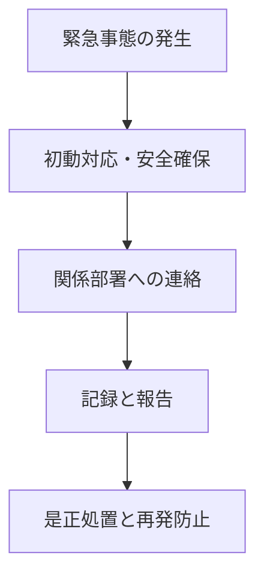

# 順守義務と緊急事態対応

## 3.1 順守義務の定義

順守義務（Compliance Obligations）とは、組織が守らなければならない法的要求事項や、契約、業界ガイドラインなどを含みます。

| 項目 | 例                                |
|------|-----------------------------------|
| 法律 | 廃棄物処理法、水質汚濁防止法     |
| 契約 | 顧客との環境協定                  |
| その他 | 地域自治体との協定、ISO規格要件 |

## 3.2 緊急事態の例

- 化学物質の漏洩
- 火災・地震による設備損傷
- 近隣住民からの苦情対応

## 3.3 対応手順（フローチャート）

