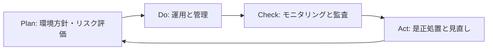

# 環境マネジメントシステム（EMS）の概要

## 1.1 ISO14001の目的

ISO14001は、組織が環境への影響を最小限に抑え、持続可能な活動を実現するための国際規格です。PDCA（Plan-Do-Check-Act）サイクルに基づき、環境方針、運用管理、順守義務への対応、継続的改善を体系化します。

## 1.2 規格構造と附属書SLとの対応

ISO14001は、ISO9001と同様に附属書SL構造（10章立て）に従っています。

| 章番号 | 内容                             |
|--------|----------------------------------|
| 4      | 組織の状況                       |
| 5      | リーダーシップと環境方針         |
| 6      | 計画（リスク、機会、側面）       |
| 7      | 支援（資源、認識、文書）         |
| 8      | 運用管理                         |
| 9      | パフォーマンス評価               |
| 10     | 改善（是正、継続的改善）         |

## 1.3 EMSとQMS（品質マネジメント）の違い

- QMS（ISO9001）は「顧客満足と品質」を中心とする
- EMS（ISO14001）は「環境リスクと順守義務」への対応が中心

## 1.4 PDCAモデル（EMS版）

