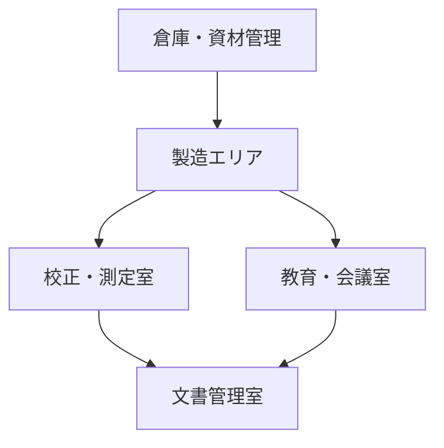

# 🏭 設備・施設配置マップ（Facility Map）

本ドキュメントは、ISO 9001:2015 Clause 7.1「資源」に基づき、  
製造・校正・教育訓練等に用いる主要な施設・設備の配置および機能を可視化する教材です。

EduLms教材全体のうち、**教育・校正・品質保証の現場と紐づく配置の把握**を目的としています。

---

## 🗺️ 施設構成とゾーン分類（例）

| ゾーン | 名称             | 主な用途                           |
|--------|------------------|------------------------------------|
| Z1     | 製造エリア       | 加工、組立、検査                   |
| Z2     | 校正・測定室     | 精密測定、校正、温湿度管理エリア   |
| Z3     | 教育・会議室     | 教育訓練、力量評価、改善会議など   |
| Z4     | 文書管理室       | 教材ファイル、記録書類、帳票保管   |
| Z5     | 倉庫・資材管理   | 受入検査済品、原材料、予備品保管等 |

---

## 🖼️ Mermaidによる施設構造の簡易図（例）

> 🧩 Mermaid図は物理配置の概略構造を示し、教材内で施設イメージを共有する目的で使用します。

---

## 🧰 校正・教育の配置留意点

- 校正室は恒温・恒湿管理が可能な構造とする
- 教育室にはプロジェクター・ホワイトボード・教材配架スペースを確保
- 文書管理室は施錠可能な保管庫と教育記録ファイル棚を含む

---

## 🔗 関連教材リンク

- [`equipment_list.xlsx`](./equipment_list.xlsx)
- [`measurement_management.md`](./measurement_management.md)
- [`training/`](../training/)
- [`document_control_template.md`](../templates/document_control_template.md)
- [`qms_overview.md`](./qms_overview.md)

---

## 📜 ライセンス

MIT License © 2025 Shinichi Samizo / Samizo-AITL
