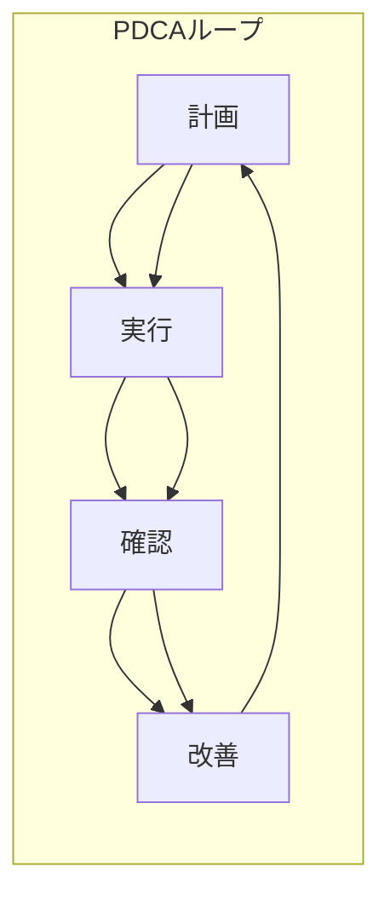

# 📘 QMS全体構成（ISO 9001:2015 概要とPDCA）【拡張版】

本ドキュメントは、ISO 9001に基づく**品質マネジメントシステム（QMS）**の全体像を構造的に整理し、  
EduLms教材全体の中でPDCAとの接続位置を可視化するための要約ページです。

---

## 🌀 品質マネジメントの基本構造：PDCA

| フェーズ | 対応項目           | 関連文書例                      |
|----------|--------------------|---------------------------------|
| P（計画） | 品質方針、目標設定、リスク機会 | `qms_overview.md`, `training_plan_template.md` |
| D（実行） | 製品提供、教育訓練、測定機器 | `process_control.md`, `measurement_management.md` |
| C（確認） | 監査、測定、力量評価          | `audit/`, `training_record_form.md` |
| A（改善） | 是正・予防措置、レビュー       | `nonconformity.md`, `corrective_actions.md` |

---

## 📐 ISO 9001:2015章別 × EduLms教材マッピング

| Clause | 内容                     | 対応教材／ディレクトリ              |
|--------|--------------------------|------------------------------------|
| 4      | 組織の状況               | `context_analysis.md`, `stakeholder_map.md` |
| 5      | リーダーシップ           | `quality_policy.md`, `top_commitment.md` |
| 6      | 計画                     | `qms_overview.md`, `risk_assessment_form.md` |
| 7.1    | 資源                     | `equipment_list.xlsx`, `facility_map.md` |
| 7.2    | 力量                     | `training/`, `competence_matrix.md` |
| 7.3    | 認識                     | `training/`, `awareness_checklist.md` |
| 7.5    | 文書化した情報           | `document_control_template.md`     |
| 8      | 運用                     | `process_control.md`, `qc_tools/` |
| 9      | パフォーマンス評価       | `audit/`, `measurement_management.md` |
| 10     | 改善                     | `corrective_actions.md`, `nonconformity.md` |

---

## 🧭 QMS構造図（PDCAの可視化）

> 詳細構造は [`mermaid_diagrams/qms_pdca_flow.mmd`](../mermaid_diagrams/qms_pdca_flow.mmd) を参照

---

## 🏢 実務現場での活用の流れ（例）

1. **教育訓練計画（P）**：`training_plan_template.md` を活用し、年間スケジュール策定  
2. **力量評価（C）**：`competence_matrix.md` と `training_record_form.md` により力量確認  
3. **是正報告（A）**：`nonconformity.md` に記録し、`corrective_actions.md` で再発防止策を立案  
4. **定期監査（C）**：`audit_report_template.md` に従って実施・報告  

---

## 🗂 成果物・記録様式一覧

| ドキュメント名 | 用途 | 備考 |
|----------------|------|------|
| `quality_policy.md` | 品質方針 | Clause 5 |
| `document_control_template.md` | 文書管理表 | Clause 7.5 |
| `training_record_form.md` | 教育記録 | Clause 7.2 |
| `audit_report_template.md` | 監査記録 | Clause 9.2 |
| `corrective_actions.md` | 是正措置報告 | Clause 10.2 |

---

## 📎 関連リンク

- [ISO 9001:2015 – Clause 4–10](https://www.iso.org/standard/62085.html)
- [`training/competence_matrix.md`](../training/competence_matrix.md)
- [`qc_tools/qc7tools_overview.md`](../qc_tools/qc7tools_overview.md)
- [`mermaid_diagrams/qms_pdca_flow.mmd`](../mermaid_diagrams/qms_pdca_flow.mmd)

---

## 📌 Appendix：GitHub + EduLms連携構想

- `.md`ベースの教材はGitHub上で管理され、`competence_matrix.md` に基づく力量管理が可能
- `mermaid_diagrams/` により視覚教材化、`templates/` で帳票出力も統一
- GitHub ActionsやWebhookを通じて、修正履歴を教育訓練ログに反映可能（LMS連携構想）

---
MIT License © 2025 Shinichi Samizo / Samizo-AITL
