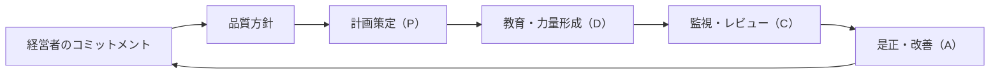

# 🏛 経営者のリーダーシップとコミットメント（Top Management Commitment）

本ドキュメントは、ISO 9001:2015 Clause 5.1 に基づく **トップマネジメントの責任と役割** を明確にし、  
EduLmsを含む品質マネジメントシステム（QMS）の有効性を高めるための指針を記述します。

---

## 🎯 経営者の責務（Clause 5.1 対応）

| 項目 | 内容 |
|------|------|
| QMSの有効性に対する説明責任 | 品質方針と品質目標の整合性を確保し、PDCAを通じて成果を検証します。 |
| 顧客重視の徹底 | 要求事項の満たされた製品・サービスの提供と、顧客満足の向上を重視します。 |
| リスク・機会への対応 | `risk_assessment_form.md` に基づき、戦略的課題をマネジメントします。 |
| 品質マネジメント文化の醸成 | 全従業員が品質に責任を持つ文化を推進し、教育・認識活動を強化します。 |
| プロセス志向の強化 | QMSをプロセスとして捉え、改善に向けて有機的に連携します。 |

---

## 🧭 品質方針との接続

- [`quality_policy.md`](./quality_policy.md) にて掲げる「〇〇に貢献する品質創造の文化」は、経営者のコミットメントによって推進されます。
- 品質方針は年次の**マネジメントレビュー（Clause 9.3）**にて見直しが行われます。

---

## 🔗 教育・認識活動との連携

- Clause 7.2（力量）や 7.3（認識）への支援として、以下の仕組みを構築：
  - [`training_plan_template.md`](../training/training_plan_template.md)：年間教育計画
  - [`awareness_checklist.md`](../training/awareness_checklist.md)：ISO認識の自己評価
  - [`competence_matrix.md`](../training/competence_matrix.md)：職務と力量の見える化

---

## 🧩 PDCAへの統合位置

この構造は qms_pdca_flow.mmd に基づいて可視化されます。

---

## 📎 関連リンク

- [`quality_policy.md`](./quality_policy.md)  
- [`risk_assessment_form.md`](./risk_assessment_form.md)  
- [`context_analysis.md`](./context_analysis.md)  
- [`training/`](../training/)  
- [`qms_overview.md`](./qms_overview.md)  

---

## 📜 ライセンス

MIT License © 2025 Shinichi Samizo / Samizo-AITL
