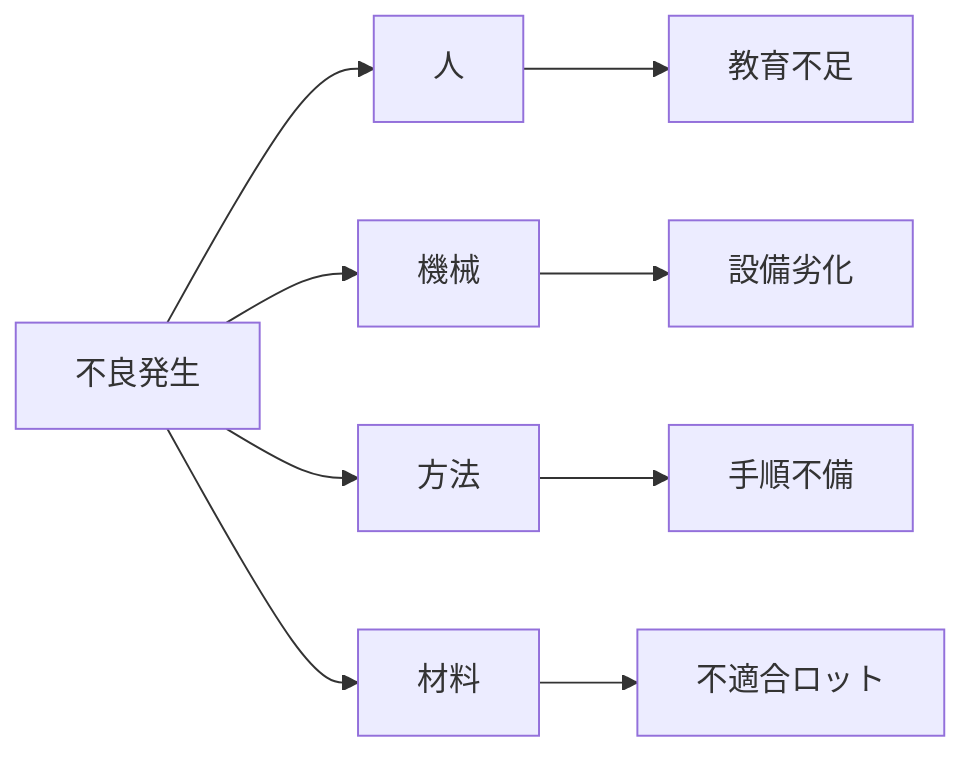

# 🐟 特性要因図（Cause and Effect Diagram）教材

本フォルダは、QC七つ道具の一つである **特性要因図（フィッシュボーン図）** を学ぶための教材とテンプレートを収録しています。

特性要因図は、「問題（特性）」に対して「要因」を構造的に洗い出し、**根本原因の探索や改善方針の検討**に非常に有効なツールです。

---

## 📌 特性要因図とは？

- 「特性（結果）」と「要因（原因）」の因果関係を**魚の骨のように可視化**した図。
- 問題の背景にある複数の要因を、**系統的・視覚的に整理**するのに適しています。
- 別名：「フィッシュボーン図」「石川ダイアグラム」

---

## 🛠️ 活用場面の例

| 活用シーン | 具体例 |
|------------|--------|
| 不良対策 | 発生した不良の背景要因を網羅的に抽出し、改善につなげる |
| クレーム分析 | 苦情の発生原因を「人・設備・方法」など分類別に洗い出す |
| 品質改善会議 | ブレーンストーミング結果を図示し、議論を構造化する |
| 新人教育 | 問題分析の「思考の型」として訓練に活用できる |

---

## 📁 ファイル構成（予定）

```plaintext
cause_effect/
├── samples/                        # サンプル教材（Markdown / PNG / Excel）
│   ├── fishbone_example.md         # Mermaid記法による例
│   └── fishbone_chart.xlsx         # Excelベースの作図例
├── templates/                      # 空テンプレート（CSV / Excel）
│   └── fishbone_template.xlsx
└── README.md                       # このファイル
```

---

## ✍️ よく使われるカテゴリ（4M, 5M+E）

| 分類体系 | 内容 |
|----------|------|
| **4M** | 人（Man）／機械（Machine）／方法（Method）／材料（Material） |
| **5M+E** | 上記に 環境（Environment）／測定（Measurement） を加えたもの |

> 📌 各カテゴリの枝に「なぜなぜ分析」を加えることで、**原因の深掘り**が可能になります。

---

## 💡 Mermaidで描く特性要因図（簡易例）



> ✳ Mermaid記法では見た目は魚骨風ではありませんが、因果構造の可視化として活用可能です。

---

## 🔗 関連教材リンク

- [`qc_tools/`](../)：QC七つ道具のトップフォルダ
- [`iso9001/`](../../iso9001/)：是正処置や再発防止策での活用
- [`training/`](../../training/)：品質教育・問題解決スキルの訓練素材として

---

## 🧠 学習活用のヒント

- ブレスト形式で付箋やホワイトボードに書き出した後、フィッシュボーン図に整理すると効果的です。
- Excelテンプレートに直接記入してPDF化・報告書添付する運用も可能です。

---

## 📜 ライセンス

MIT License © 2025 Shinichi Samizo / Samizo-AITL
