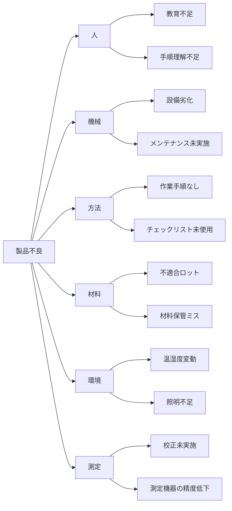

# 🐟 フィッシュボーン図（特性要因図）サンプル

このファイルは、Mermaid.js を用いて**特性要因図（Cause and Effect Diagram）**を簡易的に表現したサンプルです。  
「問題の構造化」を視覚的に行うことで、原因の網羅と深掘りを支援します。

---

## 📌 分析対象の特性（結果）

> **特性：製品不良の発生率が高い**

---

## 💡 フィッシュボーン図（Mermaid記法）

---

## ✅ 補足

- Mermaidでは、見た目はクラシックな魚骨構造にはなりませんが、**因果構造の可視化**としては十分活用できます。
- この例では、**5M+E分類（Man, Machine, Method, Material, Measurement, Environment）**を採用しています。
- 図の描画には [Mermaid Live Editor](https://mermaid.live/) を利用するか、VS Code の Mermaid プレビュー拡張が便利です。

---

## 🔗 関連ファイル

- [`fishbone_chart.xlsx`](./fishbone_chart.xlsx) – Excelで作図＋要因記入できるサンプル
- [`fishbone_template.xlsx`](../templates/fishbone_template.xlsx) – 空の記入テンプレート

---

## 🧠 応用ポイント

- それぞれの枝要因に対して「なぜ？」を繰り返すことで、**なぜなぜ分析**にも展開できます。
- ブレーンストーミングで得られた意見をこの図にマッピングし、**会議の構造化**や**報告資料化**に活用可能です。

---
